### 1.类加载器 是 **java 虚拟机** 提供给**应用程序**去获取类和接口字节码数据的的技术

类加载的流程：

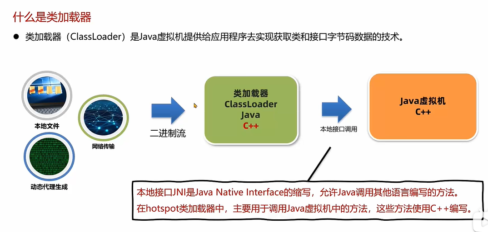

获取字节码文件 ：由 类加载器完成，类加载器只负责加载二进制 字节码文件

jvm虚拟机由c++编写 ，负责 生成 方法区对象 ，和生成堆上Class对象

### 2.类加载器的应用场景

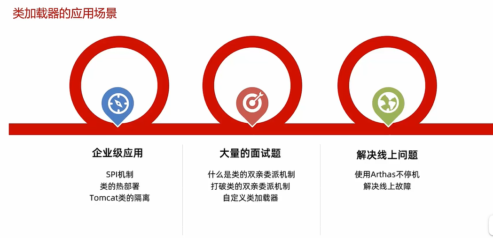

#### 3.类加载器的分类

1. java虚拟机底层源码实现 ：
   - 启动类加载器 bootstrap
2. Java代码中实现
   - 扩展类加载器Extension ，应用程序类加载器

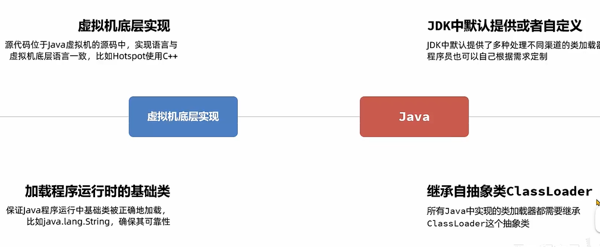

### 4.使用arthas观察当前jvm信息

- arthas 相关命令：`https://arthas.aliyun.com/doc/commands.html`
- `classloader`
  - 打印以下信息
  - 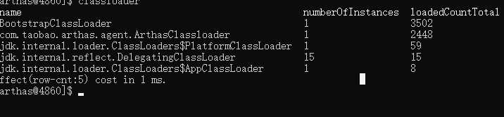
  - numberOfInstance ：类加载器的个数  loaderCountTotal：加载的核心类
  - **启动类加载器个数为1** 
  - $:代表静态内部类
  - arthas类加载器个数为1
  - ExClassLoader：扩展类加载器
  - DelegatingClassLoader :提高反射效率类加载器
  - AppClassLoader：应用程序类加载器
  - PlatformClassLoade：java9之后才有：载Java SE平台的系统模块
    - 扩展：类加载器之间存在一个层次结构，其中`PlatformClassLoader`是`Bootstrap ClassLoader`的子加载器，而`System ClassLoader`是`PlatformClassLoader`的子加载器。

### 5：启动类加载器：由hotspot虚拟机提供，使用c++编写

1. 功能：默认加载/jre/lib

2. 注意点：java9之后jdk包含jre

3. 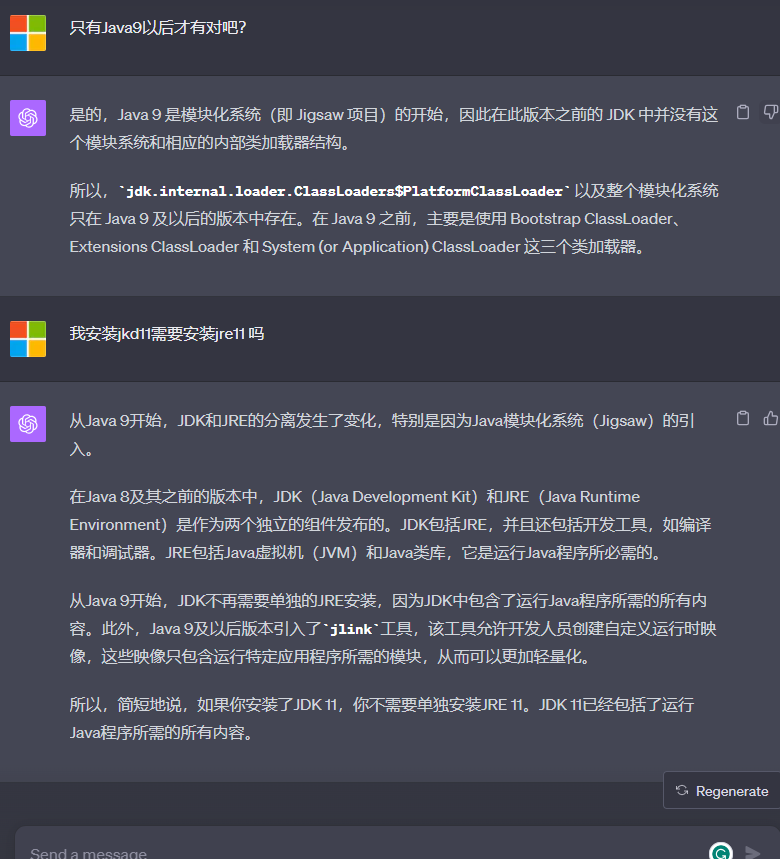

4. 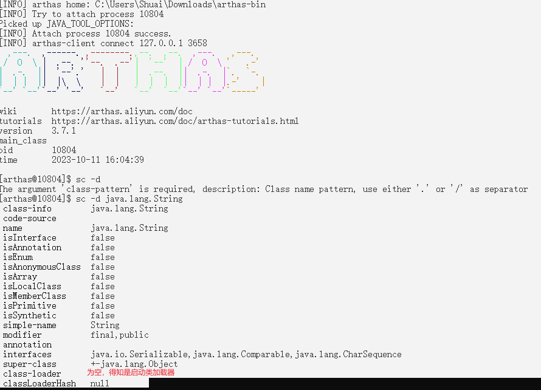

5. 校验启动类加载器：

   1. 创建一个maven项目，编写一个java脚本，并且打jar包，可以把jar包放在自定位置

      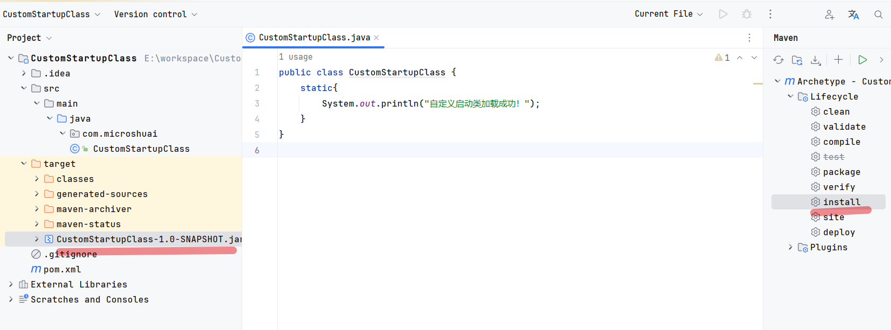

   2. 在idea测试启动类中勾选jvm配置： `-add jvm options`

   3. 输入需要加载的启动类jar包路径：`-Xbootclasspath/a:`+jar包绝对路径

      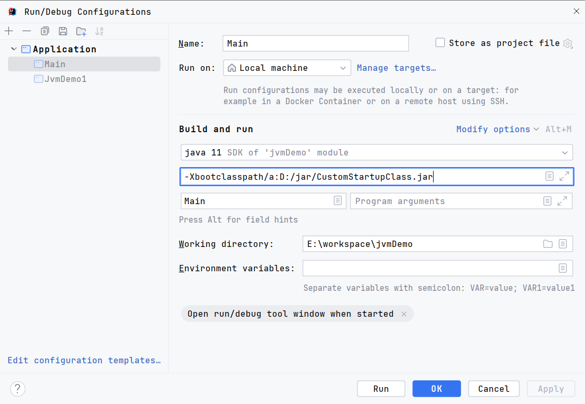

   4. 执行代码，启动类的类加载器为null，则**启动类加载器（bootstrap）**，

   5. **总结：由此得出，启动类加载器bootstrap加载类到jvm虚拟机，为了安全考虑，程序员是不能去访问启动类加载器和jvm的**

      - 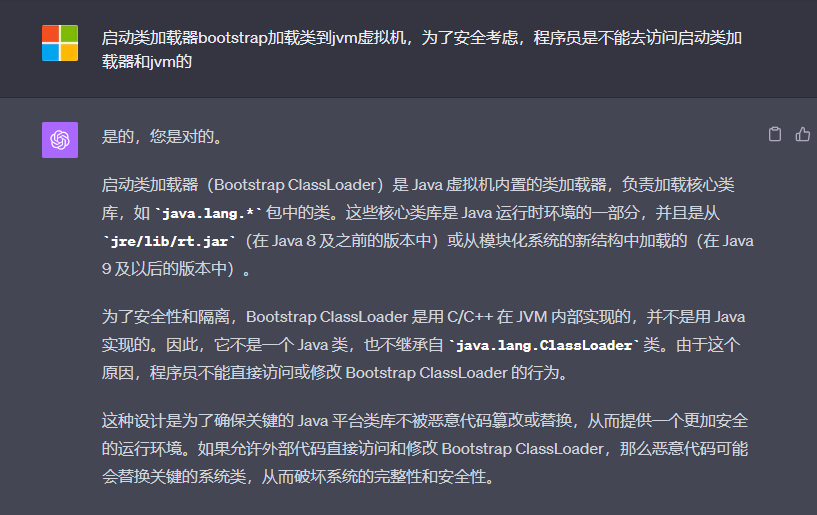
      - 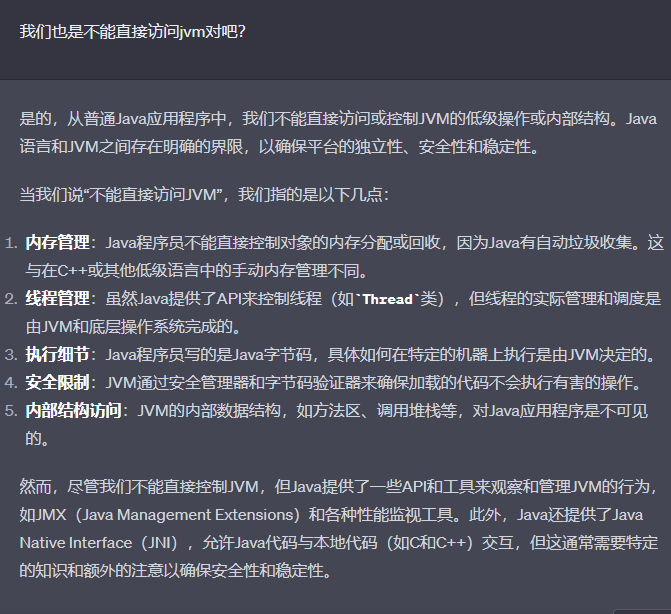

      

### 6.扩展类加载器

1. 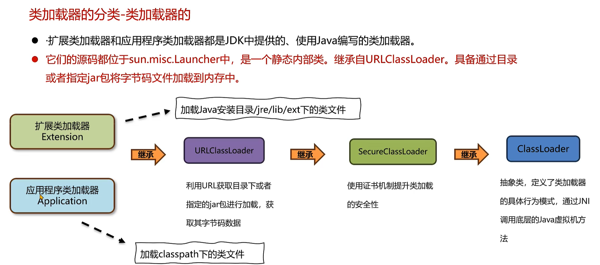

2. 在idea测试启动类中勾选jvm配置： `-add jvm options` 

   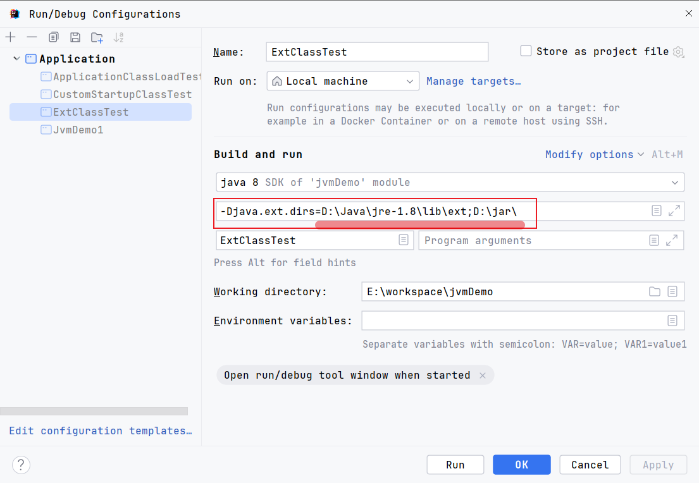

3. 配置`-Djava.ext.dirs=`+ext目录;自定义jar包目录（不是某个jar包的目录，而是要导入jar包的父目录）

4. 测试编写代码

   ​	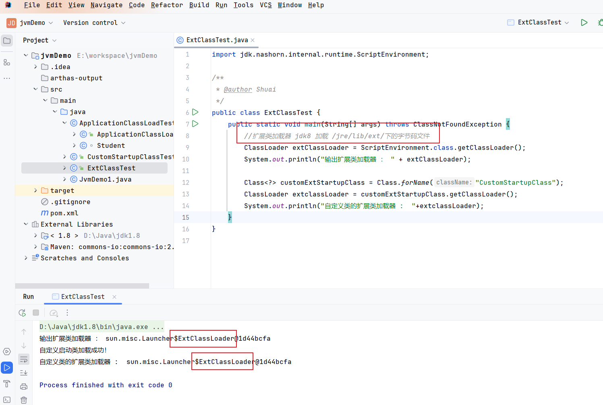

5. 成功加载之前的自定义类，所以**扩展类加载 /jre/lib/ext/ 和我们自定义jar包的 字节码文件**

### 7.应用程序类加载器

1. 导入maven commos坐标

   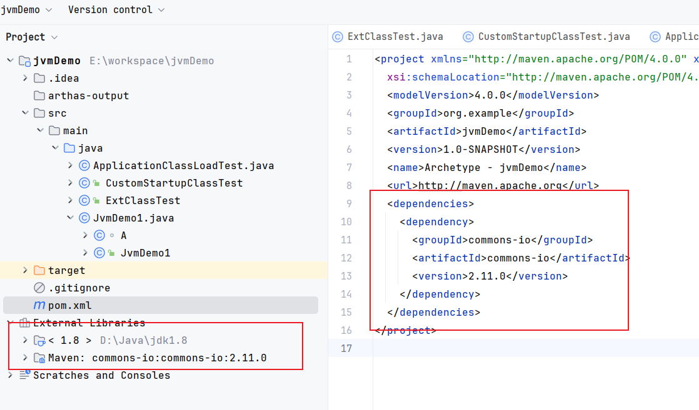

2. 编写自定义student类

3. 执行代码

   ​	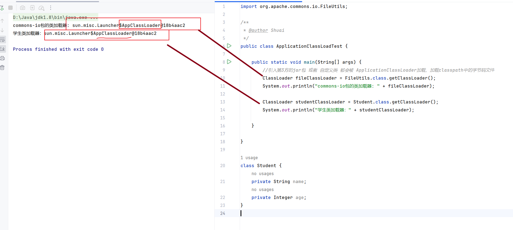

4. 由此判断，应用程序类加载器：**加载自定义类，和第三方库的类**

### 8.通过启动Arthas来校验结果是否正确

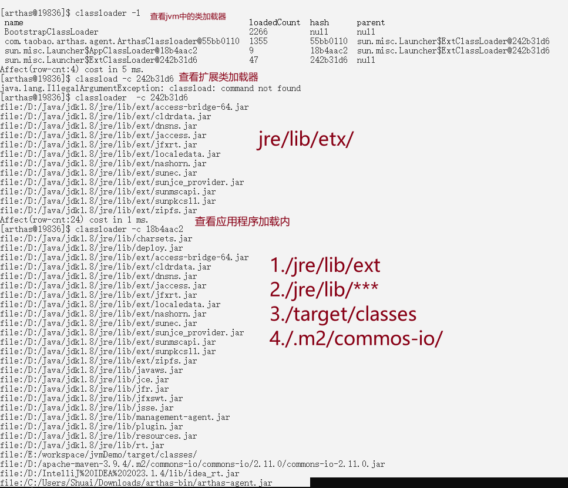

启动Arthas jar包后 ，可以看到

1. 扩展类加载器确实是加载的 /jre/lib/ext/ 下面的所有文件
2. 应用程序类加载器 
   - /lib/ext 扩展jar
   - /lib/**    运行环境所依赖的jar
   - /target/classes  当前编译路径下的 **字节码文件**
   - /.m2/  本地环境所依赖的jar包 

遗留问题？ 应用程序不应该只加载 第三方jia包和 当前编译路径下的 **字节码文件** 吗？

这就涉及 类的 双亲委派机制

